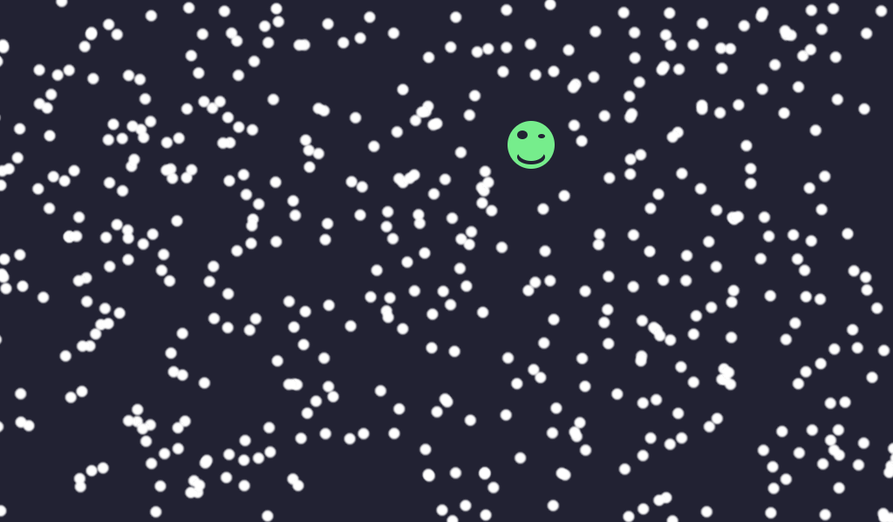

# Gdextension Project ~ Bullet Shower


This project is a GDExtension equivalent of the demo-project "Bullet Shower", which can be found here:  
https://github.com/godotengine/godot-demo-projects/tree/master/2d/bullet_shower

The main aim of this project is to provide an example of how one could structure a GDExtension addon using CMake.

This project contains the following:
- Allowing out-source builds
- Usage of a package manager (vcpkg)
- Using presets to build for various targets
- Cross-compiling support
- An included demo godot project


## Other Example Projects:  

https://github.com/asmaloney/GDExtensionTemplate

https://github.com/vorlac/godot-roguelite


## Screenshots




---
Note for vs-code users:  
You may want to add ```"cmake.copyCompileCommands": "${workspaceFolder}/compile_commands.json"``` to your workspace settings (```.vscode/settings.json```) for clangd to work properly
